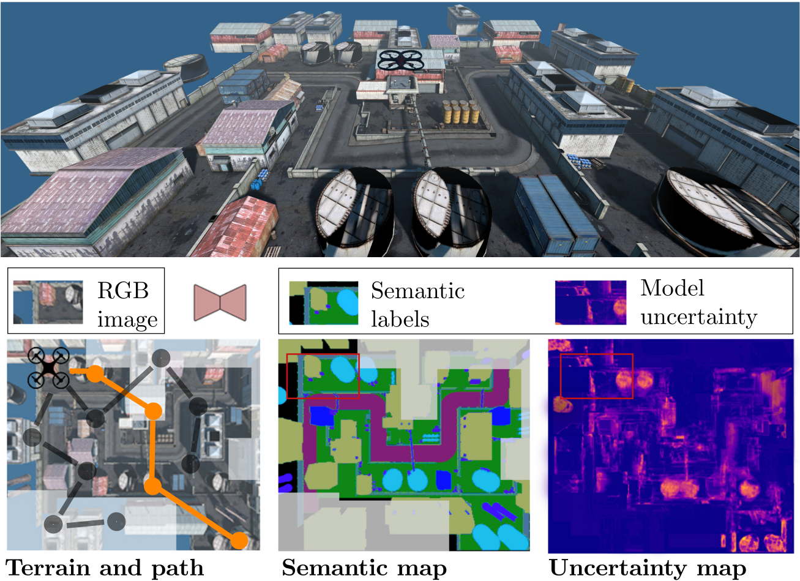
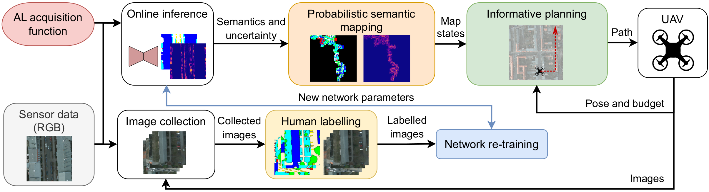

# An Informative Path Planning Framework for Active Learning in UAV-based Semantic Mapping

This repository contains the code of our paper "An Informative Path Planning Framework for Active 
Learning in UAV-based Semantic Mapping". We propose a novel general planning framework for unmanned 
aerial vehicles (UAVs) to autonomously acquire informative training images for model re-training.
Our framework maximises model performance and drastically reduces labelling efforts. 
The paper can be found [here](https://arxiv.org/pdf/2203.01652.pdf).

## Abstract

Unmanned aerial vehicles (UAVs) are crucial for
aerial mapping and general monitoring tasks. Recent progress
in deep learning enabled automated semantic segmentation of
imagery to facilitate the interpretation of large-scale complex
environments. Commonly used supervised deep learning for
segmentation relies on large amounts of pixel-wise labelled data,
which is tedious and costly to annotate. The domain-specific
visual appearance of aerial environments often prevents the
usage of models pre-trained on a static dataset. To address this,
we propose a novel general planning framework for UAVs to
autonomously acquire informative training images for model re-
training. We leverage multiple acquisition functions and fuse
them into probabilistic terrain maps. Our framework combines
the mapped acquisition function information into the UAV’s
planning objectives. In this way, the UAV adaptively acquires
informative aerial images to be manually labelled for model
re-training. Experimental results on real-world data and in a
photorealistic simulation show that our framework maximises
model performance and drastically reduces labelling efforts. Our
map-based planners outperform state-of-the-art local planning.

If you found this work useful for your own research, feel free to cite it.
```commandline
@article{ruckin2023informativeframework,
  title={{An Informative Path Planning Framework for Active Learning in UAV-based Semantic Mapping}},
  author={R{\"u}ckin, Julius and Magistri, Federico and Stachniss, Cyrill and Popovi{\'c}, Marija},
  journal={arXiv preprint arXiv:2302.03347},
  year={2023},
}
```

## System Overview



Our general planning framework for active learning in UAV-based semantic mapping deployed in a 
photo-realistic simulator (top). We compute an acquisition function, e.g. 
model uncertainty, and predict semantic segmentation online (centre-right) and fuse both in terrain 
maps (bottom-right). Our map-based planners replan a UAV's path (orange, bottom-left) to collect the 
most informative, e.g. most uncertain (yellow), images for network re-training. Our approach reduces 
the number of images that must be manually labelled to maximise semantic segmentation performance.



Overview of our approach. We start with a pre-trained semantic segmentation network deployed on a UAV. 
During a mission, the network processes RGB images to predict pixel-wise semantic labels, model 
uncertainties and novelty scores, which are projected onto the terrain to build global maps capturing 
these variables. Based on the current UAV position, budget, and posterior map state, our algorithm 
plans paths for the UAV to collect informative training data for improving the network performance. 
After the mission, the collected images are labelled by an annotator and used for network re-training. 
By guiding the UAV to collect informative training data, our pipeline reduces the human labelling effort.

## Manual Setup & Installation 

### Prerequisites

1. Install ROS noetic as described [here](http://wiki.ros.org/noetic/Installation/Ubuntu).
2. Install Flightmare simulator as described [here](https://github.com/uzh-rpg/flightmare). Download our industrial flightrender binary files:

```commandline
curl -LO https://phenoroam.phenorob.de/geonetwork/srv/api/records/be36e0bc-bb15-4e7c-b341-5754670ff29c/attachments/RPG_Flightmare.zip
```

Extract the archive in your Flightmare workspace *src/flightmare/flightrender* directory.
3. Optional: Create a *set_credentials.sh* script with the following lines to enable usage of the provided Telegram and Slack experiment bots:
```commandline
export TELEGRAM_CHAT_ID=<YOUR_TELEGRAM_CHAT_ID>
export TELEGRAM_TOKEN=<YOUR_TELEGRAM_TOKEN>
export SLACK_TOKEN=<YOUR_SLACK_TOKEN>
export SLACK_BOTNAME=<YOUR_SLACK_BOTNAME>
export SLACK_WEBHOOK=<YOUR_SLACK_WEBHOOK>
```

Learn how to setup your own Slack webhook [here](https://api.slack.com/messaging/webhooks). Learn to setup your own Telegram bot [here](https://core.telegram.org/bots/tutorial).


### Install Repository

1. Clone repo and initialize submodules:
```commandline
git clone git@github.com:dmar-bonn/ipp-al-framework.git
cd ipp-al-framework
git submodule update --init
pip3 install -r bayesian_erfnet/requirements.txt
pip3 install -r requirements.txt
```
2. Download orthomosaics, generated train-val-test splits, and pretrained Bayesian ERFNet:
```commandline
./download_data.sh
```
3. Run the active learning pipeline:

3.1. Set environment variables in terminal:
```commandline
export PYTHONPATH=$(pwd):$(pwd)/bayesian_erfnet/
source /opt/ros/noetic/setup.bash
source <PATH-TO-FLIGHTMARE-WORKSPACE>/devel/setup.bash
source set_credentials.sh (optional)
```

3.2. Execute framework with orthomosaic-based simulator
```commandline
python3 main.py --config_file config/<CONFIG-FILE>.yaml
```

or in the Flightmare simulator

```commandline
python3 main_ros.py --config_file config/<CONFIG-FILE>.yaml
```

## Docker Setup

Create directory for this project in current working directory and clone this repository:

```commandline
mkdir tro_project
cd tro_project
git clone --recurse-submodules git@github.com:dmar-bonn/ipp-al-framework.git
cd ipp-al-framework/
```

Create ROS workspace for the [UZH Flightmare simulator](https://github.com/uzh-rpg/flightmare):
```commandline
mkdir -p flightmare_ws/src/
cd flightmare_ws/src/
git clone git@github.com:uzh-rpg/flightmare.git
```

Build docker image for this project:
```commandline
cd ../../
docker build -t al_ipp:framework .
```

Download orthomosaics, generated train-val-test splits, and pretrained ERFNet:
```commandline
./download_data.sh
```

Run planning pipeline in a docker container with NVIDIA GPU acceleration:
```commandline
docker run --rm --gpus all -v $(pwd):/ipp-al-framework/ -it al_ipp:framework bash -c "cd /ipp-al-framework/ && source source_envs.sh && python3 main.py --config_file config/<CONFIG-FILE>.yaml"
```

or without NVIDIA GPU acceleration:
```commandline
docker run --rm -v $(pwd):/ipp-al-framework/ -it al_ipp:framework bash -c "cd /ipp-al-framework/ && source source_envs.sh && python3 main.py --config_file config/<CONFIG-FILE>.yaml"
```

The pipeline executes the number of missions specified in *config/config.yaml*.
All config files are saved to the disk. During a mission, the collected train data is saved to the disk.
After each mission, the map, the planned path, and the evaluation metrics of the retrained model
are saved to the disk.

## Customized Usage of Framework

If you would like to use the framework with your own pre-trained Bayesian ERFNet, orthomosaic or train-val-test data split, follow the steps below.  

1. Download and unpack your custom orthomosaic, e.g. [Potsdam](https://www.isprs.org/education/benchmarks/UrbanSemLab/2d-sem-label-potsdam.aspx).
2. Pre-train your Bayesian-ERFNet model on a semantic segmentation dataset, e.g. Cityscapes, as described [here](https://github.com/dmar-bonn/bayesian_erfnet).
3. Generate a train-validation-test image split of your custom orthomosaic as described in the subsection below.
4. Empty the *training_set/images* and *training_set/anno* folder of your generated dataset split.
5. Adapt the *path_to_checkpoint* in your *config/&lt;CONFIG-FILE&gt;.yaml* to your model checkpoint path.

### Generate Custom Data Split

1. Adapt the *path_to_orthomosaic* and *path_to_anno* attributes in your *config/&lt;CONFIG-FILE&gt;.yaml* file to your orthomosaic RGB and Labels directories.
2. Adapt the *path_to_dataset* in your *bayesian_erfnet/agri_semantics/config/&lt;MODEL-CONFIG-FILE&gt;.yaml* file to the dataset directory path.
3. Set environment variables in terminal:
```commandline
export PYTHONPATH=$(pwd):$(pwd)/bayesian_erfnet/
source /opt/ros/noetic/setup.bash
source <PATH-TO-FLIGHTMARE-WORKSPACE>/devel/setup.bash
source set_credentials.sh (optional)
```
3. Execute the dataset generator for orthomosaic-based simulator
```commandline
python3 dataset_generator.py --config_file config/<CONFIG-FILE>.yaml --dataset_folder <DATASET-FOLDER> --num_data_samples <NUM-DATA-SAMPLES>
```

or the dataset generator in the Flightmare simulator

```commandline
python3 dataset_generator.py --config_file config/<CONFIG-FILE>.yaml
```

where *<DATASET-FOLDER>* is either 'training_set', 'validation_set' or 'test_set', and *<NUM-DATA-SAMPLES>* is the number of to be generated image-annotation data points.

## Development

### Style Guidelines

In general, we follow the Python [PEP 8](https://www.python.org/dev/peps/pep-0008/) style guidelines. Please install [black](https://pypi.org/project/black/) to format your python code properly.
To run the black code formatter, use the following command:

```commandline
black -l 120 path/to/python/module/or/package/
```

To optimize and clean up your imports, feel free to have a look at this solution for [PyCharm](https://www.jetbrains.com/pycharm/guide/tips/optimize-imports/).

### Maintainer

Julius Rückin, [jrueckin@uni-bonn.de](mailto:jrueckin@uni-bonn.de), Ph.D. student at [PhenoRob - University of Bonn](https://www.phenorob.de/)

## Acknowledgement

We would like to thank Jan Weyler for providing a PyTorch Lightning ERFNet implementation.

## Funding

This work was funded by the Deutsche Forschungsgemeinschaft (DFG,
German Research Foundation) under Germany’s Excellence Strategy - EXC
2070 – 390732324. Authors are with the Cluster of Excellence PhenoRob,
Institute of Geodesy and Geoinformation, University of Bonn.